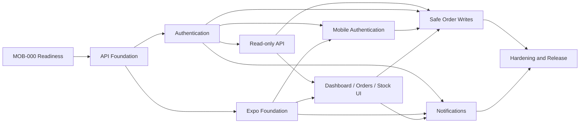

# Mathukai Mobile Phase 1 Task Backlog

**Status:** Ready for implementation authorization

**Date:** 19 July 2026

**Scope:** Task decomposition of the approved Phase 1 delivery plan.

This backlog does not authorize implementation. Work starts only after an
explicit instruction to begin implementation and only on the first approved
slice.

## 1. Conventions

### Priority

- **P0:** Security, tenant isolation, data integrity, or release blocker.
- **P1:** Required Phase 1 product capability.
- **P2:** Useful operational improvement that can follow the critical path.

### Relative size

- **S:** Small, focused change with narrow test surface.
- **M:** Multiple coordinated files or a new bounded service.
- **L:** High-risk business workflow or cross-platform integration; split into
  reviewable commits even when tracked as one product task.

### Task completion

A task is complete only when:

- Acceptance criteria pass.
- Focused tests are added and pass.
- Tenant isolation is tested when data is tenant-owned.
- OpenAPI and documentation are updated when the contract changes.
- `manage.py check` or the relevant mobile checks pass.
- No unrelated files are staged.
- The commit contains one coherent change.

## 2. Dependency map



Read-only backend and Expo foundation can progress independently after their
shared prerequisites. Order writes do not start until both read-only API and
mobile authentication gates pass.

## 3. Milestone 0 - readiness and superseded prototype

### MOB-000 Confirm external prerequisites

- **Priority/size:** P0 / S
- **Depends on:** Approved design baseline
- **Owner:** Product/operations
- **Outcome:** Record current availability for the local Android toolchain,
  Expo, optional EAS cloud builds, Google Play, Firebase, monitoring, domains, signing backup,
  and final brand assets.
- **Acceptance:** Missing external accounts are assigned to the milestone that
  needs them; non-blocking assets are explicitly marked as placeholders.
- **Commit:** Documentation only.

### MOB-001 Define environment identity matrix

- **Priority/size:** P0 / S
- **Depends on:** MOB-000
- **Outcome:** Finalize development, staging, and production Android package
  IDs, API hosts, deep-link hosts, Expo project plan, and Firebase project plan.
- **Acceptance:** No environment shares a production database or push
  credential accidentally.
- **Commit:** `Document mobile environment identity matrix`.

### MOB-002 Remove Bubblewrap packaging workspace

- **Priority/size:** P1 / S
- **Depends on:** MOB-001 and explicit implementation authorization
- **Outcome:** Remove the superseded TWA-only `mobile/android` package and its
  dependency lockfile without touching unrelated user files.
- **Acceptance:** Git diff contains only TWA packaging removal and relevant
  ignore cleanup; Django remains unchanged.
- **Commit:** `Remove superseded Android TWA packaging`.

### MOB-003 Adapt domain association design

- **Priority/size:** P0 / M
- **Depends on:** MOB-001
- **Outcome:** Keep Android Digital Asset Links under the approved package ID.
- **Acceptance:** Environment-specific signing fingerprints; empty safe defaults
  claim no unconfigured app; focused endpoint tests.
- **Commit:** `Prepare Android App Links association`.

### Gate M0

- External account gaps and their required milestones recorded.
- Environment identity matrix approved.
- TWA workspace removal independently reviewable.
- No secret or signing material in Git.

## 4. Milestone 1 - API foundation

### API-001 Add REST framework dependency and configuration

- **Priority/size:** P0 / S
- **Depends on:** Gate M0
- **Outcome:** Add Django REST Framework with secure default authentication and
  permission settings; no business endpoints yet.
- **Acceptance:** Anonymous API access denied by default; existing web checks and
  focused configuration tests pass.
- **Commit:** `Add Django REST API foundation`.

### API-002 Create versioned module structure

- **Priority/size:** P0 / S
- **Depends on:** API-001
- **Outcome:** Add `core/api/v1` URL, serializer, view, permission, exception and
  pagination modules outside `core/views.py`.
- **Acceptance:** `/api/v1` namespace resolves; no business endpoint enabled;
  circular imports absent.
- **Commit:** `Create versioned mobile API modules`.

### API-003 Add request IDs and response metadata

- **Priority/size:** P0 / M
- **Depends on:** API-002
- **Outcome:** Accept a valid inbound request ID or generate one; return it in
  response headers and contract metadata; propagate safely to logs/tasks.
- **Acceptance:** Success and error tests; invalid/oversized IDs replaced; no PII
  encoded in generated IDs.
- **Commit:** `Add API request correlation IDs`.

### API-004 Standardize errors

- **Priority/size:** P0 / M
- **Depends on:** API-003
- **Outcome:** Implement validation, authentication, permission, not-found,
  conflict, throttling, business-rule and unexpected-error envelopes.
- **Acceptance:** Error contract tests; production response never includes stack
  traces or model internals.
- **Commit:** `Standardize mobile API errors`.

### API-005 Add cursor pagination

- **Priority/size:** P1 / M
- **Depends on:** API-002
- **Outcome:** Signed/opaque cursor pagination with bounded page sizes.
- **Acceptance:** Forward paging, malformed cursor, limit bounds, stable ordering
  and tenant partition tests.
- **Commit:** `Add mobile API cursor pagination`.

### API-006 Add throttle scopes

- **Priority/size:** P0 / S
- **Depends on:** API-002
- **Outcome:** Separate login, refresh, write, device and read throttle policies
  configurable by environment.
- **Acceptance:** Scope tests and `Retry-After`; tests do not rely on production
  rates.
- **Commit:** `Add mobile API throttle policies`.

### API-007 Add OpenAPI validation to CI

- **Priority/size:** P1 / S
- **Depends on:** API-002
- **Outcome:** Validate the checked-in contract and prevent unreviewed drift.
- **Acceptance:** Current schema passes without warnings; deliberately invalid
  fixture/check fails.
- **Commit:** `Validate mobile OpenAPI contract in CI`.

### Gate M1 verification

```text
python manage.py check
python manage.py test <new API foundation tests>
npx @redocly/cli lint <mobile OpenAPI file>
```

Existing login, tenant middleware, PWA and production-preflight tests also pass.

## 5. Milestone 2 - authentication and tenant access

### AUTH-001 Add warehouse membership role

- **Priority/size:** P0 / M
- **Depends on:** Gate M1
- **Outcome:** Add tenant-scoped `warehouse_operator`; do not broaden legacy
  global group access.
- **Acceptance:** Migration safety audit; cross-tenant denial; existing vendor
  roles unchanged; explicit bootstrap dry run.
- **Commit:** `Add tenant-scoped warehouse operator role`.

### AUTH-002 Add mobile session model

- **Priority/size:** P0 / M
- **Depends on:** Gate M1
- **Outcome:** Implement approved session fields, constraints and indexes.
- **Acceptance:** Model/migration tests; invalid active tenant rejected at service
  boundary; migration dry run.
- **Commit:** `Add mobile device session persistence`.

### AUTH-003 Add opaque refresh-token model

- **Priority/size:** P0 / M
- **Depends on:** AUTH-002
- **Outcome:** Persist only hashes and rotation lineage.
- **Acceptance:** Raw token absent from database, logs and repr; unique hash and
  expiry indexes; model tests.
- **Commit:** `Add hashed mobile refresh tokens`.

### AUTH-004 Implement token service

- **Priority/size:** P0 / L
- **Depends on:** AUTH-003
- **Outcome:** Issue/verify 10-minute access JWTs and rotate 30-day opaque refresh
  tokens with reuse detection.
- **Acceptance:** Claim validation, issuer/audience, clock skew, expiry, rotation,
  concurrent refresh and family revocation tests.
- **Commit boundaries:**
  1. `Add mobile access token service`
  2. `Add refresh rotation and reuse detection`

### AUTH-005 Implement DRF authentication and permissions

- **Priority/size:** P0 / M
- **Depends on:** AUTH-004, AUTH-001
- **Outcome:** Authenticate access token, validate active session/user/tenant and
  expose tenant-scoped request context.
- **Acceptance:** Disabled user, expired session, removed membership, wrong
  tenant and warehouse scope tests.
- **Commit:** `Enforce mobile session and tenant authentication`.

### AUTH-006 Implement login endpoint

- **Priority/size:** P0 / M
- **Depends on:** AUTH-004
- **Outcome:** Reuse credential validation and lockout; create session/token pair;
  return memberships.
- **Acceptance:** Success, failure, lockout, inactive user/tenant, single/multiple
  tenant and log-redaction tests.
- **Commit:** `Add mobile login endpoint`.

### AUTH-007 Implement refresh and logout

- **Priority/size:** P0 / M
- **Depends on:** AUTH-004, AUTH-005
- **Outcome:** Rotate refresh tokens and idempotently revoke sessions.
- **Acceptance:** Rotation/reuse/concurrency/logout tests; no web-session impact.
- **Commit:** `Add mobile refresh and logout endpoints`.

### AUTH-008 Implement tenant selection and current session

- **Priority/size:** P0 / M
- **Depends on:** AUTH-005, AUTH-007
- **Outcome:** Select only active membership, rotate credentials, return normalized
  roles and permissions through `/auth/me`.
- **Acceptance:** Cross-tenant denial; cache-safe tenant identity; role matrix;
  OpenAPI contract tests.
- **Commit:** `Add mobile tenant selection and session profile`.

### AUTH-009 Add session cleanup command/task

- **Priority/size:** P1 / S
- **Depends on:** AUTH-003
- **Outcome:** Bounded, rerunnable expiration and retention cleanup.
- **Acceptance:** Dry-run mode, batch limit, no active-token deletion, metrics.
- **Commit:** `Add mobile session retention cleanup`.

### Gate M2

- Independent security review complete.
- Tenant isolation and concurrent refresh suites pass.
- Migration audit and rollback procedure pass.
- Mobile business endpoints remain disabled.

## 6. Milestone 3 - read-only API

### READ-001 Add dashboard query service

- **Priority/size:** P1 / M
- **Depends on:** Gate M2
- **Outcome:** Role-aware counters/alerts with bounded tenant queries.
- **Acceptance:** Role matrix, cross-tenant counts, query-count and cache metadata
  tests.
- **Commit:** `Add tenant-scoped mobile dashboard API`.

### READ-002 Add order list serializer/query service

- **Priority/size:** P0 / M
- **Depends on:** Gate M2, API-005
- **Outcome:** Cursor list, filters, search, status/payment labels and safe summary
  fields.
- **Acceptance:** Tenant isolation, masked search, stable cursor, date boundaries,
  page limits and query counts.
- **Commit:** `Add mobile order list API`.

### READ-003 Add order detail and field policy

- **Priority/size:** P0 / L
- **Depends on:** READ-002
- **Outcome:** Detail, items, activity, customer masking and server-calculated
  allowed actions.
- **Acceptance:** Owner/operator/viewer/warehouse field snapshots; cross-tenant
  IDs; no raw payload; no integration secrets.
- **Commit boundaries:**
  1. `Add mobile order detail API`
  2. `Enforce mobile order field visibility`

### READ-004 Add product list API

- **Priority/size:** P1 / M
- **Depends on:** Gate M2, API-005
- **Outcome:** Tenant product search/filter and read-only stock state.
- **Acceptance:** Tenant isolation, SKU/barcode search, low/out-of-stock filters,
  update timestamp and query count tests.
- **Commit:** `Add mobile product list API`.

### READ-005 Add product detail and movements

- **Priority/size:** P1 / M
- **Depends on:** READ-004
- **Outcome:** Routing readiness, role-permitted prices and cursor-paginated stock
  history.
- **Acceptance:** Field visibility, tenant isolation, movement/order references,
  no mutation methods.
- **Commit:** `Add mobile product detail and stock history API`.

### READ-006 Add contract tests

- **Priority/size:** P0 / M
- **Depends on:** READ-001 through READ-005
- **Outcome:** Validate representative success and error payloads against OpenAPI.
- **Acceptance:** Contract suite covers every read operation and role.
- **Commit:** `Verify mobile read API contract`.

### Gate M3

- Tenant/role matrix passes for every endpoint.
- Query plans and performance targets pass on representative staging volume.
- Read-only API approved before any write endpoint is enabled.

## 7. Milestone 4 - Expo foundation

### APP-001 Create Expo TypeScript project

- **Priority/size:** P1 / M
- **Depends on:** Gate M1, MOB-001
- **Outcome:** `mobile/app` with stable Expo SDK, Expo Router and strict TypeScript.
- **Acceptance:** Android development build compiles; placeholder screen only;
  dependency health check passes.
- **Commit:** `Create Mathukai Operations Expo app`.

### APP-002 Configure build variants

- **Priority/size:** P0 / M
- **Depends on:** APP-001, MOB-001
- **Outcome:** Dev/staging/production identifiers, names, API hosts and EAS
  profiles selected only at build time.
- **Acceptance:** Automated config tests; no production host in dev build; no
  secret in bundle.
- **Commit:** `Configure mobile build environments`.

### APP-003 Add quality tooling

- **Priority/size:** P1 / S
- **Depends on:** APP-001
- **Outcome:** Lint, format, typecheck, unit/component test and Expo doctor scripts.
- **Acceptance:** All commands pass in CI on clean checkout.
- **Commit:** `Add mobile quality checks`.

### APP-004 Add typed API client

- **Priority/size:** P0 / M
- **Depends on:** APP-001, API-007
- **Outcome:** Generate or validate TypeScript API types/client from checked-in
  OpenAPI; wrap request IDs and error envelopes.
- **Acceptance:** Contract drift fails CI; no hand-written duplicate DTOs.
- **Commit:** `Add typed mobile API client`.

### APP-005 Add secure session storage

- **Priority/size:** P0 / M
- **Depends on:** APP-001
- **Outcome:** Refresh token only in SecureStore; access token only in memory;
  installation ID lifecycle.
- **Acceptance:** No AsyncStorage token fallback; logout purge; mocked platform
  failure tests.
- **Commit:** `Add secure mobile session storage`.

### APP-006 Add query/cache foundation

- **Priority/size:** P1 / M
- **Depends on:** APP-001
- **Outcome:** TanStack Query, user/tenant cache partition, age metadata and
  24-hour purge.
- **Acceptance:** Logout/tenant-switch purge tests; offline writes unavailable.
- **Commit:** `Add tenant-partitioned mobile read cache`.

### APP-007 Add design system and accessibility baseline

- **Priority/size:** P1 / M
- **Depends on:** APP-001
- **Outcome:** Brand tokens, typography, spacing, buttons, fields, cards, status
  treatment, loading/empty/error components.
- **Acceptance:** Font scaling, screen-reader labels, touch targets, dark/light
  theme decision and reduced-motion review.
- **Commit:** `Add accessible mobile design foundation`.

### APP-008 Add privacy-safe monitoring

- **Priority/size:** P0 / M
- **Depends on:** APP-002
- **Outcome:** Crash/error reporting with request ID, version and platform; redact
  tokens and customer data.
- **Acceptance:** Redaction tests; separate environment projects; test event.
- **Commit:** `Add privacy-safe mobile monitoring`.

### Gate M4

```text
npm run lint
npm run typecheck
npm test
npx expo-doctor
```

Android emulator and physical-device development builds install and contact
only staging.

## 8. Milestone 5 - mobile authentication

### UIA-001 Implement login screen

- **Priority/size:** P1 / M
- **Depends on:** APP-004, APP-005, APP-007, AUTH-006
- **Acceptance:** Loading/error/lockout/offline/accessibility states; password never
  persisted.
- **Commit:** `Add mobile login experience`.

### UIA-002 Implement session restoration and refresh mutex

- **Priority/size:** P0 / L
- **Depends on:** UIA-001, AUTH-007
- **Acceptance:** Concurrent 401 tests, one refresh, one retry, revoked session
  purge and background/foreground tests.
- **Commit:** `Add resilient mobile session restoration`.

### UIA-003 Implement tenant selection

- **Priority/size:** P0 / M
- **Depends on:** AUTH-008, UIA-002, APP-006
- **Acceptance:** Single tenant bypass, multiple tenant selection, cache purge,
  removed membership and accessibility tests.
- **Commit:** `Add mobile tenant selection`.

### UIA-004 Add permission-aware navigation and logout

- **Priority/size:** P0 / M
- **Depends on:** UIA-003
- **Acceptance:** Four Phase 1 tabs only; role-driven visibility; logout revokes
  server and clears local data.
- **Commit:** `Add permission-aware mobile navigation`.

### Gate M5

- Authentication passes on the Android emulator and a physical Android device.
- Security review confirms no tenant or token persistence leakage.

## 9. Milestone 6 - Phase 1 read screens

### UID-001 Dashboard screen

- **Priority/size:** P1 / M
- **Depends on:** READ-001, UIA-004, APP-006, APP-007
- **Acceptance:** Role-aware cards/actions, cached-age indicator, pull-to-refresh,
  loading/empty/offline/error states.
- **Commit:** `Add mobile operations dashboard`.

### UIO-001 Order list screen

- **Priority/size:** P1 / M
- **Depends on:** READ-002, UIA-004
- **Acceptance:** Search, approved filters, cursor loading, refresh, new-order
  indicator and accessibility tests.
- **Commit:** `Add mobile order list`.

### UIO-002 Order detail screen

- **Priority/size:** P0 / L
- **Depends on:** READ-003, UIO-001
- **Acceptance:** Permitted fields/actions, items/activity, deep-link-ready route,
  masking snapshots and all screen states.
- **Commit:** `Add mobile order detail`.

### UIS-001 Stock list screen

- **Priority/size:** P1 / M
- **Depends on:** READ-004, UIA-004
- **Acceptance:** Search, stock filters, quantity/update age, no mutation controls.
- **Commit:** `Add read-only mobile stock list`.

### UIS-002 Product detail screen

- **Priority/size:** P1 / M
- **Depends on:** READ-005, UIS-001
- **Acceptance:** Routing readiness, permitted prices, recent movements, cached
  age and role tests.
- **Commit:** `Add read-only mobile product detail`.

### Gate M6

- Read-only UAT passes for all four roles on Android.
- No Scan tab, packing completion or stock adjustment exists.

## 10. Milestone 7 - safe order writes

### WRITE-001 Extract shared order transition service

- **Priority/size:** P0 / L
- **Depends on:** Gate M3
- **Outcome:** Existing web view and future API call one tested service.
- **Acceptance:** Existing status, stock, activity, WooCommerce and WhatsApp
  regression behavior unchanged.
- **Commit boundaries:** extraction scaffolding, web adoption, dead orchestration
  cleanup only after equivalence tests.

### WRITE-002 Add order version

- **Priority/size:** P0 / M
- **Depends on:** WRITE-001
- **Acceptance:** Safe migration, atomic increments across web mutations, stale
  version tests and migration audit.
- **Commit:** `Add atomic order concurrency version`.

### WRITE-003 Add idempotency persistence/service

- **Priority/size:** P0 / L
- **Depends on:** Gate M2
- **Acceptance:** Same request replay, different request conflict, concurrent
  claim, safe result metadata, 48-hour cleanup.
- **Commit boundaries:** model/migration, service, cleanup.

### WRITE-004 Implement status endpoint

- **Priority/size:** P0 / L
- **Depends on:** WRITE-001, WRITE-002, WRITE-003
- **Acceptance:** Full transition/role/tenant matrix; `order_packed` rejected as a
  Phase 1 initiation; effects occur once; contract tests.
- **Commit:** `Add idempotent mobile order status updates`.

### WRITE-005 Implement payment-received endpoint

- **Priority/size:** P0 / M
- **Depends on:** WRITE-002, WRITE-003
- **Acceptance:** Owner/operator and business-state rules, duplicate replay,
  version conflict, activity once.
- **Commit:** `Add idempotent mobile payment confirmation`.

### WRITE-006 Add mobile action UI

- **Priority/size:** P0 / L
- **Depends on:** WRITE-004, WRITE-005, UIO-002
- **Acceptance:** Server-provided actions only, confirmation/reason fields,
  stable key per intent, no optimistic state, conflict reload flow.
- **Commit:** `Add safe mobile order actions`.

### Gate M7

- Full existing web tests and new API/mobile suites pass.
- Concurrency and tenant isolation independently reviewed.
- Mobile write feature flags remain off by default.

## 11. Milestone 8 - notifications and deep links

### PUSH-001 Add device persistence and encryption

- **Priority/size:** P0 / M
- **Depends on:** Gate M2
- **Acceptance:** Encrypted token, lookup hash, uniqueness, redaction, disablement
  and key configuration tests.
- **Commit:** `Add secure mobile device registrations`.

### PUSH-002 Add inbox, delivery and preference models

- **Priority/size:** P0 / M
- **Depends on:** Gate M2
- **Acceptance:** Tenant/user constraints, deduplication, indexes, retention and
  migration audit.
- **Commit:** `Add mobile notification persistence`.

### PUSH-003 Implement notification API

- **Priority/size:** P1 / M
- **Depends on:** PUSH-001, PUSH-002
- **Acceptance:** Register/disable device, list/read inbox, get/update preferences,
  mandatory policy, tenant/role matrix and contract tests.
- **Commit:** `Add mobile notification API`.

### PUSH-004 Implement delivery worker

- **Priority/size:** P0 / L
- **Depends on:** PUSH-002
- **Acceptance:** After-commit enqueue, safe payload, bounded retry, receipts,
  invalid-token disablement, no raw provider response storage.
- **Commit boundaries:** queue service, worker/receipts, monitoring/cleanup.

### PUSH-005 Add mobile push registration and inbox

- **Priority/size:** P1 / L
- **Depends on:** PUSH-003, APP-005, UIA-004
- **Acceptance:** Contextual permission, token refresh, unread state, preferences,
  logout disablement and Android tests.
- **Commit:** `Add mobile notifications experience`.

### PUSH-006 Implement Android App Links

- **Priority/size:** P0 / L
- **Depends on:** MOB-003, UIO-002, PUSH-005
- **Acceptance:** Logged-in/logged-out route, tenant selection, unauthorized ID,
  verified domain association on physical Android.
- **Commit:** `Add verified mobile order deep links`.

### Gate M8

- End-to-end push and deep links pass on physical Android.
- Privacy review and association validation pass.

## 12. Milestone 9 - hardening and release

### REL-001 Complete threat model and security review

- **Priority/size:** P0 / M
- **Depends on:** Gates M7 and M8
- **Acceptance:** Auth, tenant, field masking, idempotency, push, logging, deep-link
  and local-storage threats resolved or accepted by owner.
- **Commit:** Security documentation/tests only as appropriate.

### REL-002 Run performance and database review

- **Priority/size:** P0 / M
- **Depends on:** Gates M7 and M8
- **Acceptance:** Approved latency/query targets on representative staging volume;
  indexes justified by query plans.

### REL-003 Complete accessibility/device matrix

- **Priority/size:** P1 / M
- **Depends on:** Gates M7 and M8
- **Acceptance:** Minimum Android devices, font scaling, screen reader, touch
  targets, contrast, reduced motion and poor-network behavior.

### REL-004 Prepare store and privacy material

- **Priority/size:** P0 / M
- **Depends on:** MOB-000, Gate M8
- **Acceptance:** Icons, screenshots, descriptions, privacy policy, data-safety
  answers, signing ownership and backups approved.

### REL-005 Internal distribution

- **Priority/size:** P0 / M
- **Depends on:** REL-001 through REL-004
- **Acceptance:** Internal Play build, staff acceptance, crash/API
  monitoring, rollback drill.

### REL-006 Run staged tenant pilot

- **Priority/size:** P0 / L
- **Depends on:** REL-005
- **Acceptance:** Read-only pilot first; write flags enabled only for approved
  tenants; defined observation window and success/error thresholds; PWA fallback.

### REL-007 Production release decision

- **Priority/size:** P0 / S
- **Depends on:** REL-006
- **Outcome:** Explicit go/no-go record; store submission requires separate user
  authorization.

## 13. Recommended new test organization

Keep new mobile API tests outside the existing large `core/tests.py`:

```text
core/tests_mobile_api/
  test_foundation.py
  test_auth.py
  test_tenant_permissions.py
  test_dashboard.py
  test_orders_read.py
  test_orders_write.py
  test_stock_read.py
  test_idempotency.py
  test_devices.py
  test_notifications.py
  test_contract.py

mobile/app/src/
  auth/__tests__/
  features/dashboard/__tests__/
  features/orders/__tests__/
  features/stock/__tests__/
  features/notifications/__tests__/
  storage/__tests__/
```

Tests must use factory/helper data that always names tenant ownership explicitly.

## 14. First authorized implementation slice

When implementation is explicitly authorized, begin only with:

1. MOB-000 external prerequisite inventory.
2. MOB-001 environment identity matrix.
3. MOB-002 removal of superseded TWA packaging.
4. MOB-003 association endpoint adaptation.

Do not install Django REST Framework or create the Expo application in the same
slice. Complete and review Gate M0 first.
