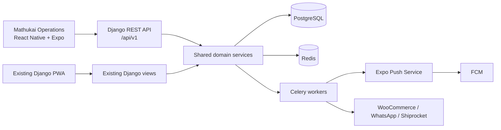
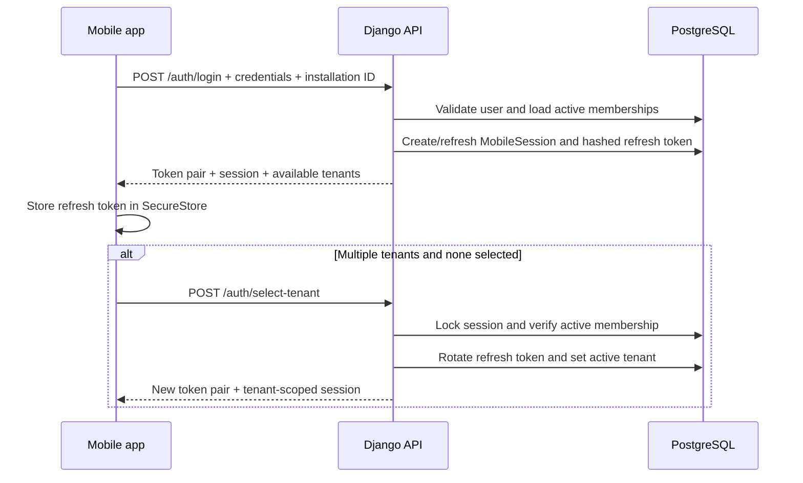
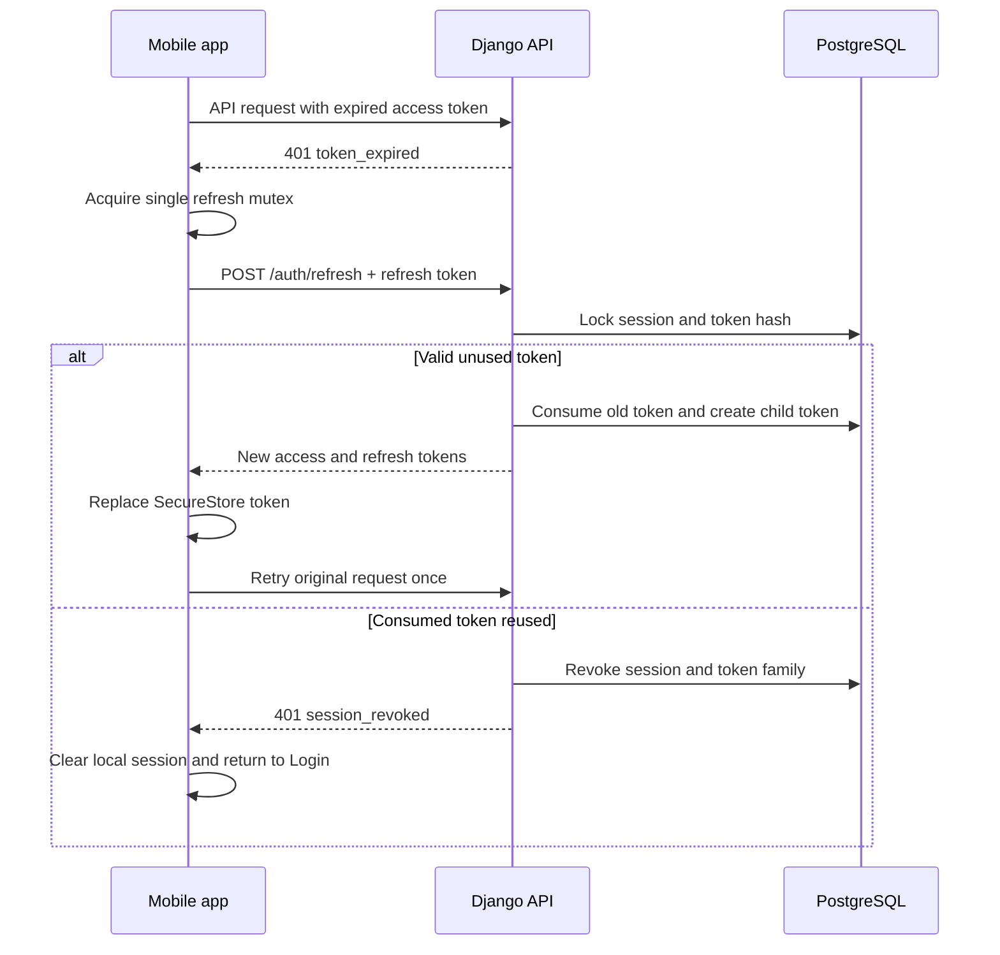
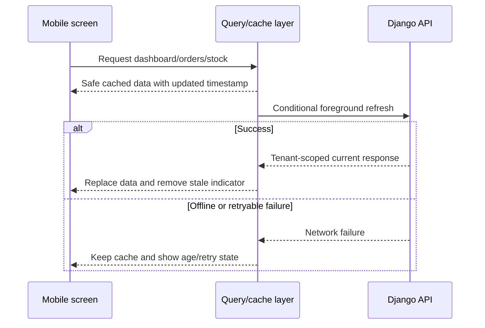
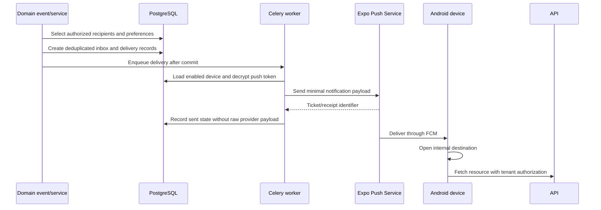

# Mathukai Mobile Phase 1 Runtime Architecture

**Status:** Approved

**Approved:** 19 July 2026

**Decision scope:** React Native application, Django REST API, authentication,
tenant authorization, order mutations, read-only stock, notification delivery,
deployment boundaries, and failure behavior.

This document does not authorize implementation.

## 1. Architecture decision

Build Mathukai Operations as a React Native and Expo application inside the
existing repository. Add a versioned Django REST Framework API to the current
Django monolith. Do not create a second backend, copy business rules into the
mobile application, or split Phase 1 into microservices.

The mobile application is a new client of the same order, stock, tenant, audit,
WooCommerce, WhatsApp, Shiprocket, Celery, Redis, and PostgreSQL domain.

### Why this shape

- It preserves the current production source of truth.
- Tenant and role policy stay in one backend.
- Stock and order side effects are not duplicated.
- Web and mobile updates share concurrency controls and audit history.
- React Native provides a genuine Android application while retaining the
  approved Expo development stack.
- The API boundary can be introduced incrementally without rewriting existing
  web workflows.

## 2. Runtime components



## 3. Repository boundaries

Recommended structure after implementation approval:

```text
mobile/
  app/                         Expo application
    app/                       Expo Router screens
    src/api/                   Generated client and request coordination
    src/auth/                  Session and secure-token handling
    src/components/            Shared accessible UI components
    src/features/dashboard/
    src/features/orders/
    src/features/stock/
    src/features/notifications/
    src/storage/               Cache adapters and purge policy
    src/testing/

core/
  api/
    v1/
      urls.py
      serializers/
      views/
      permissions.py
      pagination.py
      exceptions.py
  services/
    mobile_auth.py
    mobile_devices.py
    mobile_notifications.py
    idempotency.py
    order_mutations.py
```

The exact Python modules can be introduced slice by slice. New API
orchestration must not be added to the already-large `core/views.py`.

## 4. Responsibility boundaries

### Mobile application owns

- Screen rendering and navigation.
- Input collection and client-side usability validation.
- Secure refresh-token storage.
- In-memory access token.
- Read-only cache and its age indicators.
- One-at-a-time refresh coordination.
- Idempotency-key generation and safe retry.
- Push permission prompts and deep-link navigation.
- Friendly error presentation with request IDs.

### Django API owns

- Authentication and token rotation.
- Tenant selection and membership validation.
- Permission and field-level visibility.
- Serialization and stable API response codes.
- Allowed actions and required fields.
- Idempotency claims and replay behavior.
- Concurrency version checks.
- Request IDs, throttling, and audit context.

### Shared domain services own

- Order transition validation.
- Status timestamps.
- Stock deduction and restoration.
- Activity logging.
- WooCommerce synchronization plans.
- WhatsApp queueing.
- Product-routing calculations.

### Celery owns

- Push notification delivery and receipt checks.
- Slow external network work approved for background execution.
- Retriable delivery processing.
- Scheduled cleanup of sessions, tokens, devices, inbox records, and idempotency
  records.

## 5. API request pipeline

Authenticated requests pass through these controls in order:

```text
HTTPS termination
  -> request ID
  -> API throttling
  -> access-token authentication
  -> active user/session validation
  -> active tenant membership validation
  -> endpoint permission
  -> tenant-scoped queryset/service
  -> serializer and business validation
  -> response envelope and audit metadata
```

Write requests additionally pass through idempotency and concurrency checks
before business mutation.

## 6. Login and tenant selection



Rules:

- Passwords are handled only by the login request and are never stored.
- Login uses the existing lockout policy and API-specific throttling.
- Refresh and tenant selection rotate the refresh token.
- Access-token claims identify session, user, active tenant, issue time, and
  expiry, but database membership remains authoritative.
- A token without an active tenant can call only session and tenant-selection
  operations.

## 7. Token refresh and reuse detection



The app never performs more than one automatic retry of the original request.

## 8. Read requests and cache



Cache rules:

- The cache is partitioned by user ID and tenant ID.
- Tenant switch and logout purge the relevant cache before navigation.
- Cached data expires after no more than 24 hours.
- Customer and payment fields are excluded from long-lived cache where possible.
- The app does not present a cached status as newly confirmed.

## 9. Order-status mutation

```mermaid
sequenceDiagram
    participant App as Mobile app
    participant API as Django API
    participant DB as PostgreSQL
    participant Services as Domain services
    participant Queue as Celery/queues

    App->>API: POST status + expected version + Idempotency-Key
    API->>DB: Validate session, tenant, role; lock order
    API->>DB: Claim/check idempotency record

    alt Duplicate identical completed request
        API-->>App: Replay semantic result
    else Key used with different request
        API-->>App: 409 idempotency_conflict
    else Version changed
        API-->>App: 409 order_version_conflict
    else Transition allowed
        API->>Services: Apply transition through shared business service
        Services->>DB: Status, timestamps, stock, activity, version
        API->>DB: Complete idempotency result and commit
        API->>Queue: Enqueue after commit
        API-->>App: Updated order + effect states
    end
```

Phase 1 does not expose `order_packed` as a mobile action. Existing packed orders
remain readable and can expose later permitted actions when current server rules
allow them.

The API must call the same extracted order-mutation service as the web flow.
Implementation should first extract the current orchestration behind tests,
then make both clients call it. It must not create a parallel mobile-only status
implementation.

## 10. Payment-received mutation

Payment received uses the same tenant, permission, idempotency, order-lock, and
version controls as status changes. The transaction sets
`payment_received_at`, increments order version, records activity, and stores a
safe idempotency result.

The action appears only for vendor owners/operators when existing business
conditions allow it. The mobile client cannot infer availability from status
alone; it uses `allowed_actions`.

## 11. Notification creation and delivery



Rules:

- The inbox is created even if the user has no active device.
- Preferences are tenant-specific.
- Mandatory security categories override optional user settings.
- Permanent invalid-token responses disable the device.
- Transient errors use bounded backoff.
- A push payload contains only notification ID, category, and safe internal
  destination information.
- The device always fetches current protected data from the API after a tap.

## 12. Deep links

Supported forms:

```text
mathukai://orders/{id}
https://<approved-domain>/app/orders/{id}
```

Android App Links require deployment-time website/app associations. A deep link
is navigation intent only; the API independently
checks user, tenant, role, and object access.

If logged out, the app retains only the safe internal destination through login
and tenant selection. It does not cache the protected response.

## 13. Failure and degraded modes

| Failure | Mobile behavior | Server behavior |
| --- | --- | --- |
| No network | Show safe cache and age | No write queued |
| Access token expired | Refresh once | Rotate token transactionally |
| Refresh rejected | Return to Login | Revoke/expire session |
| Tenant membership removed | Clear tenant cache | Return 403/revoke selected context |
| Order changed concurrently | Reload prompt | Return 409 with current version reference |
| Duplicate write retry | Show prior success | Replay idempotent semantic result |
| External WhatsApp unavailable | Show order success with warning state | Keep order commit and queue/retry safely |
| Push provider transient failure | No blocking UI error | Retry through Celery |
| Push token invalid | Prompt may re-register later | Disable device token |
| Server 5xx | Retry reads manually | Return request ID and record sanitized error |

Order state must never be rolled back merely because a post-commit push or
external notification fails.

## 14. Security boundaries

- TLS is mandatory for all non-local traffic.
- Access tokens are short-lived and held in memory.
- Refresh tokens are stored in platform secure storage.
- API logs redact authorization headers, credentials, refresh tokens, push
  tokens, addresses, phone numbers, and raw request bodies for sensitive paths.
- Expo tokens are decrypted only inside the bounded push-delivery service.
- Querysets are tenant-scoped before object lookup so cross-tenant IDs return a
  non-disclosing response.
- Permissions control both objects and fields.
- Mobile role codes do not grant authority without active server membership.
- Rate limits cover login, refresh, tenant selection, writes, and device token
  registration.
- Request IDs connect mobile diagnostics, API logs, Celery jobs, and activity
  records without exposing secrets.

## 15. Deployment environments

Use separate development, staging, and production configuration:

| Concern | Development | Staging | Production |
| --- | --- | --- | --- |
| API host | Local/LAN | Staging HTTPS | Production HTTPS |
| App identifier | `.dev` suffix | `.staging` suffix | `com.mathukai.operations` |
| Database | Development | Isolated staging | Production |
| Expo project | Development channel | Preview channel | Production channel |
| Push credentials | Development | Staging | Production |
| Monitoring | Development project | Staging project | Production project |

No staging build connects to production data. Environment selection is fixed at
build time and cannot be changed by ordinary users.

## 16. Observability

Track at minimum:

- API latency and response class by operation ID.
- Login failures and lockouts without recording credentials.
- Refresh success, expiry, reuse detection, and revocation.
- Tenant access denials.
- Idempotency replay and conflict counts.
- Order version conflicts.
- Push queued, sent, failed, invalid-token, and receipt states.
- Mobile crash rate by version and platform.
- Minimum supported app version adoption.

Alerts should be actionable and tenant-safe. Metrics must not contain user,
customer, token, or order payload data as labels.

## 17. Compatibility and versioning

- `/api/v1` is the compatibility boundary.
- Additive optional response fields do not require a new major API version.
- Removing or changing field meaning requires a new version or a coordinated
  deprecation window.
- The app sends its version during login and device registration.
- The server can return minimum-supported-version metadata and a forced-upgrade
  error only when an older build is unsafe or incompatible.
- OpenAPI remains the reviewable source for client generation and contract
  tests.

## 18. Implementation order after design approval

1. Add API foundation, error envelope, request IDs, and contract tests.
2. Add session and opaque refresh-token models/services.
3. Add tenant-scoped warehouse membership transition if approved.
4. Add read-only `/auth/me`, dashboard, orders, and stock endpoints.
5. Extract shared order mutation orchestration behind regression tests.
6. Add order versioning and idempotency.
7. Add permitted status and payment mutations.
8. Add mobile devices, notification inbox, preferences, and delivery worker.
9. Create the Expo application foundation and generated API client.
10. Implement screens in auth, dashboard, orders, stock, and notifications
    slices.
11. Complete security, performance, device, and store-readiness testing.

Each slice is separately reviewable, tested, reversible where possible, and
keeps the existing PWA operational.

## 19. Architecture approval checklist

- Keep one Django backend and one PostgreSQL source of truth.
- Place new DRF code outside `core/views.py`.
- Extract and share order mutation services with the web application.
- Use opaque refresh tokens and short-lived access JWTs.
- Enforce active tenant membership on every protected request.
- Use explicit order versioning and idempotency for writes.
- Keep Phase 1 cache read-only.
- Use Celery for mobile push delivery and cleanup.
- Keep barcode scanning and packing completion in Phase 2.
- Use development, staging, and production app variants.

This checklist was approved on 19 July 2026 and completes the Phase 1
architecture design baseline.
