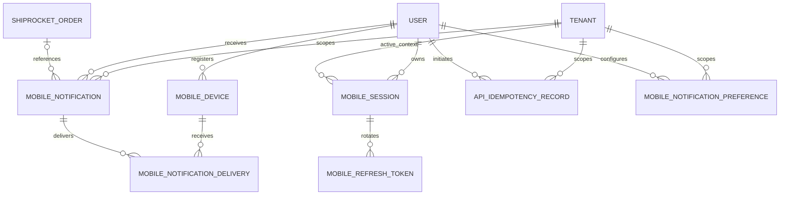

# Mathukai Mobile Phase 1 Data Model

**Status:** Proposed for design approval

**Date:** 19 July 2026

**Scope:** Database additions required by the approved Phase 1 mobile PRD and
OpenAPI contract. This document does not authorize migrations or application
implementation.

## 1. Design principles

- PostgreSQL remains the system of record.
- Every business record is tenant-scoped where the business meaning is tenant
  specific.
- Access tokens are short-lived JWTs and are not persisted.
- Refresh tokens are opaque random secrets; only cryptographic hashes are
  persisted.
- Expo push tokens are encrypted at rest and separately hashed for lookup and
  uniqueness.
- Idempotency records do not duplicate customer or payment details.
- Notification content contains no secret integration payloads or unnecessary
  customer data.
- Revocation, token rotation, idempotency and order mutation use database
  transactions and row locks.

## 2. Entity relationships

## 3. Mobile session

`MobileSession` represents one authenticated app installation for one user.

| Field | Type | Rules |
| --- | --- | --- |
| `id` | UUID primary key | Server generated |
| `user` | Foreign key to user | Required, cascade delete |
| `installation_id` | UUID | Generated once by the app |
| `platform` | String | `android` or `ios` |
| `app_version` | String | Last reported application version |
| `active_tenant` | Nullable tenant FK | Must be an active membership |
| `status` | String | `active`, `revoked`, or `expired` |
| `created_at` | Timestamp | Immutable |
| `last_seen_at` | Timestamp | Updated with bounded frequency |
| `expires_at` | Timestamp | Maximum session lifetime |
| `revoked_at` | Nullable timestamp | Set once |
| `revocation_reason` | String | Safe machine-readable code |

Constraints and indexes:

- Unique `(user_id, installation_id)`.
- Index `(user_id, status, expires_at)`.
- Index `(active_tenant_id, status)`.
- A session cannot select a tenant unless the user has an active membership.
- Disabling a user or removing the selected membership causes the next API
  request or refresh to revoke the session.

The initial maximum session expiry matches the approved 30-day refresh policy.
Successful refresh can extend the session only within the configured absolute
session limit.

## 4. Refresh token rotation

`MobileRefreshToken` stores a token generation within a mobile session.

| Field | Type | Rules |
| --- | --- | --- |
| `id` | UUID primary key | Public token identifier/JTI |
| `session` | Mobile session FK | Required, cascade delete |
| `token_hash` | Fixed string/binary | SHA-256 or keyed hash; unique |
| `parent` | Nullable self FK | Previous token in rotation chain |
| `issued_at` | Timestamp | Immutable |
| `expires_at` | Timestamp | Approved 30-day policy |
| `consumed_at` | Nullable timestamp | Set during successful rotation |
| `revoked_at` | Nullable timestamp | Set when invalidated |

Rules:

1. Generate at least 256 bits of randomness for the token secret.
2. Return the raw token once; never log or persist it.
3. Hash the token before lookup or storage.
4. Lock the token and session rows during rotation.
5. Mark the old token consumed and create its child in one transaction.
6. Reuse of a consumed token revokes the entire session and all its tokens.
7. Logout revokes the session and all unexpired tokens.

Indexes:

- Unique `token_hash`.
- Index `(session_id, expires_at)`.
- Index `(expires_at, revoked_at)` for cleanup.

Retention: delete expired/revoked token rows after 30 additional days unless an
active security investigation requires a longer audited retention period.

## 5. Mobile device registration

`MobileDevice` represents an application installation and its push destination.
It is user-scoped rather than tenant-scoped because one user can switch between
multiple tenants on the same installation.

| Field | Type | Rules |
| --- | --- | --- |
| `id` | UUID primary key | Server generated |
| `user` | User FK | Required, cascade delete |
| `installation_id` | UUID | Same installation identifier used at login |
| `platform` | String | `android` or `ios` |
| `push_token_ciphertext` | Binary/text | Encrypted Expo token |
| `push_token_hash` | Fixed string/binary | Deterministic lookup hash |
| `app_version` | String | Last reported version |
| `device_name` | Nullable string | User-friendly, not trusted |
| `enabled` | Boolean | False after logout or permanent provider error |
| `last_seen_at` | Timestamp | Updated at registration/refresh |
| `last_push_at` | Nullable timestamp | Operational monitoring |
| `disabled_at` | Nullable timestamp | Set when disabled |
| `disabled_reason` | String | Safe provider/application code |
| `created_at` | Timestamp | Immutable |
| `updated_at` | Timestamp | Automatic |

Constraints and indexes:

- Unique `(user_id, installation_id)`.
- Unique active `push_token_hash` to prevent the same token being assigned to
  multiple active records.
- Index `(user_id, enabled)`.
- Index `(enabled, last_seen_at)` for stale-device cleanup.

The encryption key is supplied through the deployment secret manager and is not
stored in Django settings source, the database, logs, or mobile application.

## 6. Notification inbox

`MobileNotification` is the durable, tenant-scoped inbox item shown in the app.

| Field | Type | Rules |
| --- | --- | --- |
| `id` | Big integer primary key | Server generated |
| `tenant` | Tenant FK | Required, cascade delete |
| `user` | User FK | Required, cascade delete |
| `category` | String | Approved Phase 1 category |
| `title` | String | No unnecessary customer data |
| `message` | String | No secrets or raw provider payloads |
| `destination_type` | String | `order`, `orders`, `stock`, or `none` |
| `order` | Nullable order FK | Must belong to the same tenant |
| `deduplication_key` | Nullable string | Event-recipient uniqueness |
| `read_at` | Nullable timestamp | Null means unread |
| `created_at` | Timestamp | Immutable |
| `expires_at` | Nullable timestamp | Retention/purge control |

Approved categories:

- `new_order`
- `order_attention`
- `status_change`
- `routing_alert`
- `integration_alert`

Constraints and indexes:

- Unique `(tenant_id, user_id, deduplication_key)` when a key is present.
- Check that `order.tenant_id == tenant_id` when `order_id` is present; enforce
  in the service layer and database trigger only if later justified.
- Index `(tenant_id, user_id, read_at, created_at DESC)`.
- Index `(user_id, created_at DESC)`.
- Index `(expires_at)` for cleanup.

Push notification text is derived from this safe inbox record. Deep-link routing
uses `destination_type` and internal identifiers, never a caller-supplied URL.

Initial retention recommendation: retain inbox items for 90 days, then purge or
archive according to the approved operational retention policy.

## 7. Notification delivery

`MobileNotificationDelivery` tracks delivery to each active installation.

| Field | Type | Rules |
| --- | --- | --- |
| `id` | Big integer primary key | Server generated |
| `notification` | Notification FK | Required, cascade delete |
| `device` | Device FK | Required, cascade delete |
| `status` | String | `queued`, `sent`, `delivered`, `failed`, `invalid` |
| `provider_receipt_id` | Nullable string | Expo receipt identifier |
| `attempt_count` | Positive integer | Incremented atomically |
| `last_error_code` | String | Sanitized code only |
| `queued_at` | Timestamp | Immutable |
| `sent_at` | Nullable timestamp | Provider accepted |
| `confirmed_at` | Nullable timestamp | Receipt checked |
| `updated_at` | Timestamp | Automatic |

Constraints and indexes:

- Unique `(notification_id, device_id)`.
- Index `(status, updated_at)` for Celery processing and retry.
- Index `(device_id, created/queued time)` for device diagnostics.

Provider errors that identify a permanently invalid token disable the device.
Transient errors use bounded retries with backoff. Raw provider responses are
not stored.

## 8. Notification preferences

`MobileNotificationPreference` stores tenant-specific choices for a user.

| Field | Type | Rules |
| --- | --- | --- |
| `id` | Big integer primary key | Server generated |
| `tenant` | Tenant FK | Required, cascade delete |
| `user` | User FK | Required, cascade delete |
| `category` | String | Approved Phase 1 category |
| `enabled` | Boolean | Default determined by category policy |
| `created_at` | Timestamp | Immutable |
| `updated_at` | Timestamp | Automatic |

Constraints:

- Unique `(tenant_id, user_id, category)`.
- Preferences are ignored if the user no longer has active tenant access.
- Security-critical categories can be marked mandatory by server policy even if
  the stored preference is disabled.

The OpenAPI contract must expose read and update operations for these records
before implementation.

## 9. Idempotency

`ApiIdempotencyRecord` protects Phase 1 write operations from duplicated mobile
requests.

| Field | Type | Rules |
| --- | --- | --- |
| `id` | Big integer primary key | Server generated |
| `tenant` | Tenant FK | Required |
| `user` | User FK | Required |
| `key` | UUID | From `Idempotency-Key` |
| `operation` | String | Stable operation code |
| `request_hash` | Fixed string/binary | Canonical method/path/body hash |
| `status` | String | `in_progress`, `completed`, or `failed` |
| `resource_type` | String | Safe internal resource code |
| `resource_id` | Nullable string | Result resource identifier |
| `result` | JSON | Minimal non-PII replay metadata |
| `response_status` | Nullable integer | Original HTTP status |
| `created_at` | Timestamp | Immutable |
| `completed_at` | Nullable timestamp | Terminal transition |
| `expires_at` | Timestamp | Cleanup boundary |

Constraints and indexes:

- Unique `(tenant_id, user_id, key)`.
- Index `(status, created_at)` for abandoned-request recovery.
- Index `(expires_at)` for cleanup.

Processing rules:

1. Canonicalize and hash the request.
2. Insert an `in_progress` record before the business mutation.
3. The idempotency record and business mutation commit in the same transaction
   where feasible.
4. The same key and same request returns the stored semantic result.
5. The same key with a different request hash returns `409 Conflict`.
6. A concurrent in-progress duplicate receives a retryable conflict or waits for
   the bounded original transaction.
7. Result JSON stores identifiers, transition outcome, and safe effect states;
   it does not copy customer, address, payment, or provider payload data.

Initial retention recommendation: 48 hours after completion, long enough for
mobile retry windows while limiting duplicated operational data.

## 10. Order concurrency version

Add a positive big-integer `version` field to `ShiprocketOrder`, defaulting to
`1`. Every API-visible order mutation increments it atomically in the same
transaction.

The mobile API returns an opaque string representation of this version. Status
and payment requests submit `expected_version`; a mismatch returns
`409 order_version_conflict` without applying the mutation.

An explicit version is preferred over `updated_at` because timestamp precision
and unrelated updates can produce unclear concurrency behavior. Existing web
mutations must increment the same version once the API is introduced so web and
mobile edits remain coordinated.

## 11. Warehouse role gap

The existing tenant membership model contains `vendor_owner`,
`vendor_operator`, and `vendor_viewer`. Warehouse access currently relies on the
legacy global `ops_viewer` group, which is not a sufficient tenant-scoped mobile
authorization model.

Recommended design:

- Add `warehouse_operator` to `TenantMembership.ROLE_CHOICES`.
- Map eligible existing warehouse users to explicit active tenant memberships.
- Keep the legacy group temporarily for the web transition.
- Return `warehouse_operator` through `/auth/me`.
- Scope warehouse order access through tenant membership and the existing
  operational assignment rules.
- Do not grant Phase 1 packing, scanning, stock mutation, or platform settings
  permissions to this role.

This role addition requires explicit approval before migrations are designed.

## 12. Transaction boundaries

### Refresh rotation

Lock session and refresh-token rows, validate, consume old token, create new
token, and update `last_seen_at` in one transaction.

### Status update

Lock order, compare version, claim idempotency key, validate permission and
transition, update status/version/timestamps, perform current stock/audit work,
and complete the idempotency record within the existing safe transaction
boundary. External notification work remains queued after commit.

### Payment received

Lock order, compare version, claim idempotency key, update payment timestamp and
version, write activity record, and complete idempotency metadata in one
transaction.

### Notification creation

Create one inbox record per authorized recipient using a deterministic
deduplication key. Create delivery rows for enabled devices after transaction
commit and process them through Celery.

## 13. Cleanup jobs

Daily or scheduled tasks should:

- Mark sessions and tokens expired.
- Delete refresh-token history beyond retention.
- Disable stale device registrations after the approved inactivity threshold.
- Purge expired notification inbox and delivery records.
- Purge completed idempotency records after 48 hours.
- Alert on idempotency records left `in_progress` beyond the transaction timeout.

Cleanup tasks must be tenant-safe, bounded in batch size, observable, and safe
to rerun.

## 14. Migration sequence

1. Add the four independent foundations: session/token, device, notification,
   and idempotency tables.
2. Add notification preferences and delivery tracking.
3. Add the order version field with a safe default and indexes.
4. If approved, add `warehouse_operator` and create explicit memberships.
5. Deploy read-only schema support before enabling API writes.
6. Backfill or migrate no raw tokens, push tokens, or notification content from
   browser sessions unless separately approved.

Every migration requires a production-scale dry run, rollback plan, tenant
isolation tests, and RC migration-safety audit.

## 15. Design decisions awaiting approval

- Add the tenant-scoped `warehouse_operator` membership role.
- Use opaque hashed refresh tokens rather than persisted refresh JWTs.
- Encrypt Expo push tokens at rest and store a separate lookup hash.
- Retain idempotency records for 48 hours.
- Retain notification inbox records for 90 days.
- Use an explicit atomic order version shared by web and mobile mutations.
- Treat notification preferences as a required Phase 1 API surface.

No model, migration, API, or background-task implementation begins from this
document until these decisions are approved.
